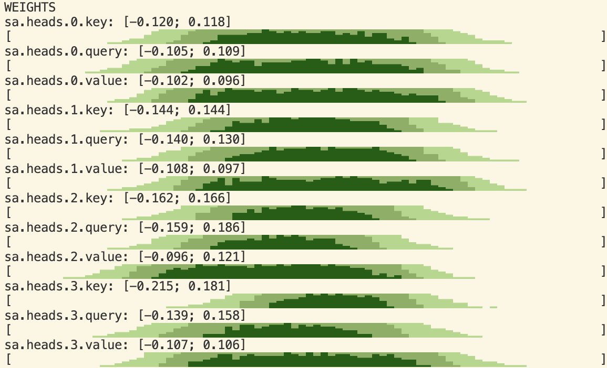
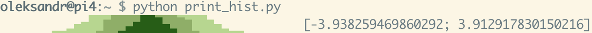

# fewlines

Whether we like it or not, we debug things by putting print statements around.

`fewlines` is a supplement for this, allowing to plot charts which only take few lines in a terminal output, but can be a very useful piece of information.

Example use-case could be plotting distribution of weights, gradients and activations for layers in NN.



While created originally to plot distributions of weights/gradients it can be also used to visualize time series and
is not restricted to ML use cases, obviously. Can be used to show latency distribution, for example.

Installation:
```
pip install fewlines
```

## Usage examples

Minimal example:
```
from fewlines.horizon import horizon_line
print(horizon_line([i for i in range(100)]))
```


Print distribution with default formatting:
```
from fewlines.horizon import print_histogram
import numpy as np
print_histogram(np.random.normal(size=10000))
```




## TODO
* more examples, including Colab
* move torch-specific printing to separate module
* unit tests
* scatter-like chart
* negative values support
* shared y scale